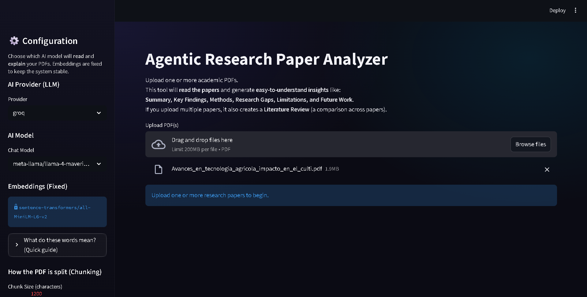
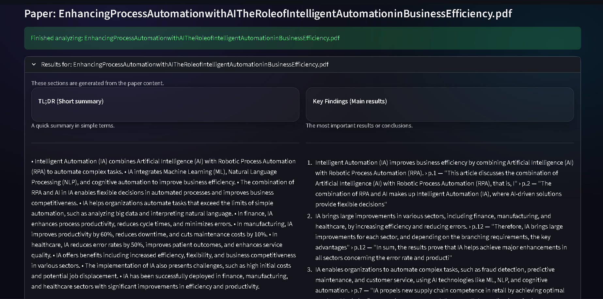

# 📄 Agentic Research Paper Analyzer

> Upload a research paper PDF and let AI extract structured insights using a full **RAG (Retrieval-Augmented Generation)** pipeline — with page-level citations, anti-hallucination design, and a multi-paper Literature Review.


---

## 📸 Preview

> _Add your screenshots inside an `images/` folder and update the paths below._

| Main Interface | Analysis Results |
|---|---|
|  |  |

---

## ✨ Features

| Feature | Details |
|---|---|
| **Structured Extraction** | TL;DR · Key Findings · Research Gap · Methods · Future Work · Limitations |
| **Page-level Citations** | Every claim is backed by a quote + page number from the paper |
| **Anti-hallucination Design** | Model is forced to respond "Not found in paper" if evidence is missing |
| **4-Step Agent Workflow** | Plan → Retrieve → Extract → Verify → Refine |
| **FAISS Vector Index** | Cached to `.cache/` for fast repeated queries |
| **Multi-provider LLM Support** | Groq · HuggingFace · OpenAI-compatible · Gemini · Anthropic |
| **Multi-paper Literature Review** | Upload 2+ papers to get a cross-paper comparison |
| **Interactive UI** | Streamlit app with live progress logs and dark theme |

---

## 🔄 Agent Workflow

```
PDF Upload
    │
    ▼
Text Extraction  (pypdf)
    │
    ▼
Chunking  (RecursiveCharacterTextSplitter)
    │
    ▼
Embeddings  (sentence-transformers/all-MiniLM-L6-v2)
    │
    ▼
FAISS Vector Index  (cached to disk)
    │
    ▼
Step 1 — PLAN      Analyze first page → generate section-specific queries
    │
    ▼
Step 2 — RETRIEVE  Run FAISS similarity search for each section
    │
    ▼
Step 3 — EXTRACT   LLM generates structured JSON for each section
    │
    ▼
Step 4 — VERIFY    Check evidence depth; re-retrieve if sparse
    │
    ▼
Confidence Assessment
    │
    ▼
Structured Research Insights  (displayed in Streamlit cards)
```

---

## 📁 Project Structure

```
paper_agent_streamlit/
│
├── app.py                    ← Streamlit UI entry point
│
├── paper_agent/
│   ├── agent.py              ← Plan → Retrieve → Extract → Verify orchestration
│   ├── pdf_loader.py         ← PDF text extraction (pypdf)
│   ├── chunking.py           ← Text splitting with overlap
│   ├── vectorstore.py        ← FAISS build / load / search
│   ├── llm.py                ← LLM client factory (Groq, HuggingFace, etc.)
│   ├── prompts.py            ← All LLM prompts
│   ├── schemas.py            ← Pydantic models (PaperAnalysis, LiteratureReview)
│   ├── report_writer.py      ← Markdown/JSON export + literature review
│   └── utils.py              ← JSON parsing, cache helpers
│
├── requirements.txt
├── .env.example
├── .gitignore
└── README.md
```

---

## 🚀 Quick Start

### 1. Clone the repository

```bash
git clone https://github.com/your-username/paper-agent-streamlit.git
cd paper-agent-streamlit
```

### 2. Create and activate a virtual environment

**Windows (PowerShell):**
```powershell
python -m venv .venv
.\.venv\Scripts\Activate.ps1
```

**Linux / macOS:**
```bash
python -m venv .venv
source .venv/bin/activate
```

### 3. Install dependencies

```bash
pip install -r requirements.txt
```

### 4. Set up environment variables

```bash
# Windows
copy .env.example .env
notepad .env

# Linux / macOS
cp .env.example .env
nano .env
```

Add your API keys to `.env`:

```env
GROQ_API_KEY=gsk_...
HUGGINGFACE_API_KEY=hf_...

# Optional (for other providers)
OPENAI_API_KEY=sk-...
GOOGLE_API_KEY=...
ANTHROPIC_API_KEY=sk-ant-...
```

### 5. Run the app

```bash
streamlit run app.py
```

Open in your browser: **http://localhost:8501**

---

## 🔑 Supported LLM Providers

| Provider | Notes |
|---|---|
| **Groq** | Recommended — fast inference, free tier available at [console.groq.com](https://console.groq.com) |
| **HuggingFace** | Free tier available at [huggingface.co](https://huggingface.co/settings/tokens) |
| **OpenAI-compatible** | Any OpenAI-format API (OpenAI, Together, Fireworks, etc.) |
| **Gemini** | Google AI Studio key required |
| **Anthropic** | Claude models |

> **Embeddings** always use `sentence-transformers/all-MiniLM-L6-v2` locally — no embedding API key needed.

---

## ⚙️ Configuration Options

All settings are available in the **Streamlit sidebar**:

| Setting | Default | Description |
|---|---|---|
| Provider | `groq` | LLM provider for analysis |
| Chat Model | `llama-4-maverick` | Model to use for extraction |
| Chunk Size | `1200` chars | Size of each text chunk |
| Chunk Overlap | `200` chars | Overlap between adjacent chunks |
| Top-K | `6` | Number of chunks retrieved per query |
| Rebuild Index | `false` | Force rebuild the FAISS cache |

---

## 📊 Output Schema

Each analyzed paper returns:

```json
{
  "title": "string",
  "authors": ["string"],
  "year": "string",
  "tldr": "bullet-point summary",
  "key_findings": "findings with page citations",
  "research_gap": "gaps with page citations",
  "methods_used": "methods with page citations",
  "future_work": "future directions with citations",
  "limitations": "limitations list",
  "confidence_notes": "self-assessment of extraction quality"
}
```

Multi-paper uploads additionally produce a `LiteratureReview`:

```json
{
  "overview": "string",
  "method_comparison": "string",
  "common_findings": "string",
  "cross_paper_gaps": "string"
}
```

---

## ⚠️ Known Limitations

- **Scanned PDFs** (image-only) require OCR preprocessing — try [`ocrmypdf`](https://github.com/ocrmypdf/OCRmyPDF) first
- **Very long papers** (100+ pages) will take longer to embed and index
- **Page number citations are approximate** — based on chunk metadata, not visual layout
- **English-language prompts perform best** — non-English papers may give weaker results

---

## 🛣️ Roadmap

- [ ] OCR preprocessing with `ocrmypdf`
- [ ] Streaming LLM output in real time
- [ ] Export results as Markdown / PDF report
- [ ] Citation export (BibTeX, RIS)
- [ ] Paper comparison mode (side-by-side diff)
- [ ] Fully offline mode (local Ollama models)
- [ ] Docker container for one-command deployment

---

## 🛠️ Built With

- [Streamlit](https://streamlit.io/) — web UI
- [LangChain](https://www.langchain.com/) — RAG orchestration
- [FAISS](https://github.com/facebookresearch/faiss) — vector similarity search
- [pypdf](https://github.com/py-pdf/pypdf) — PDF text extraction
- [sentence-transformers](https://www.sbert.net/) — local embeddings
- [Pydantic v2](https://docs.pydantic.dev/) — structured output validation
- [Groq](https://groq.com/) / [HuggingFace](https://huggingface.co/) — LLM inference

---

## 👨‍💻 Author

**MN Mohamed** — Applied Data Science

[](https://linkedin.com/in/your-profile)
[](https://github.com/your-username)

---

## 📜 License

This project is licensed under the **MIT License** — see the [LICENSE](LICENSE) file for details.

---

## 🙏 Acknowledgements

- [Facebook Research](https://github.com/facebookresearch/faiss) for the FAISS library
- [Groq](https://groq.com/) for fast LLM inference
- [LangChain](https://www.langchain.com/) for the RAG framework

---

> 💡 **Tip:** Add screenshots to an `images/` folder in your repo and update the image paths at the top of this README to make your project page shine.
